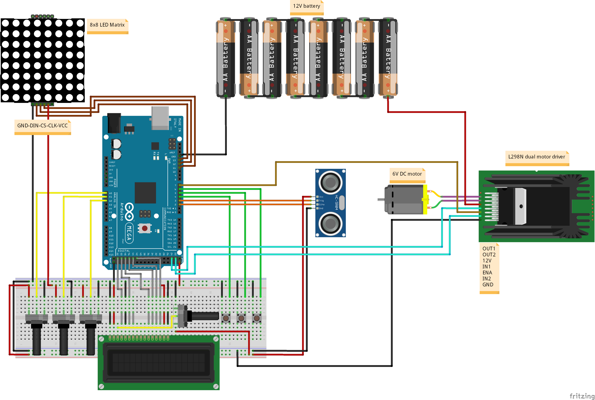

# Model elevator project with Arduino

## ELECTRONIC COMPONENTS
- **Arduino MEGA 2560**  
- **L298N Dual Motor Driver**  
- **6V DC Motor**  
- **HC-SR04 Ultrasonic Distance Sensor**  
- **8x8 LED Matrix**  
- **2x16 LCD**  
- **4 x 10k Potentiometer**  
- **3 x Push Button**  
- **8 x 1.5V Battery**  
- **Jumper Cables**

## CIRCUIT

## CONSTRUCTION COMPONENTS
- **4 x Support Arm**  
- **String**  
- **Motor Stabilizer**  
- **Base**  
- **Top Cover of the Elevator**  
- **Cabin**  
- **3 x Hook**  
- **3 x Floor Label**  

> The material, shape, and sizes of the above construction components are not specified in order to allow flexibility in material selection. The elevator can be constructed using suitable materials.

## CONSTRUCTION OF THE ELEVATOR
Construction schematic photo